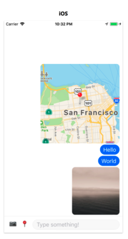
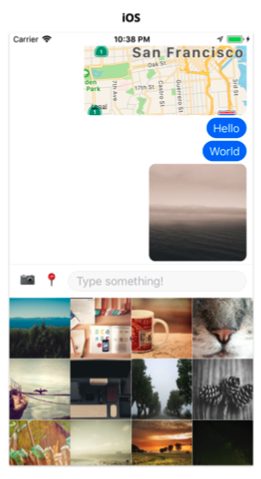
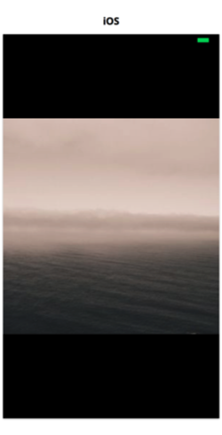
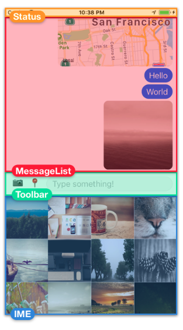

# RN_Messaging

### Description of messaging app
##### A simple messaging app that will let us send text, send photos from the camera roll and share our location. It will let us know that we are disconnected from the network. It will handle keyboard interactions and the back button on Android

---

### Application screens
#### MessagingList Screen

#### MessagingList with camaraRoll

#### ViewPhoto Screen

---

 #### Breaking down MessagingList Screen
 

 ---

 ### KEY POINTS
 + API components used 
   - **Alert** : Displays modal dialog window for simple user input
   - **BackHnadler** : Controls the back button on Android
   - **CameraRoll** Returns images and videos stored on the device.
   - **Dimensions** Returns the dimensions of the screen
   - **Geolocation** returns the location of the device and emits events when location changes.
   - **Keyboard** Emits events when keyboard appears or disappears
   - **NetInfo** Returns network connectivity information, and emits events when connectivity changes.
   - **PixelRatio** Translates from density-independent pixels to density-dependent pixels.
   - **StatusBar** Controls the visibility & color of status bar
+ **pointerEvents={'none'}** added to Status component so that the view doesnt prevent us from tapping the *ScrollView* we'll rendr it.
The *pointerEvents* prop allows us to control whether an component can respond to touch interactions or whether they pass through to the component behind it.

